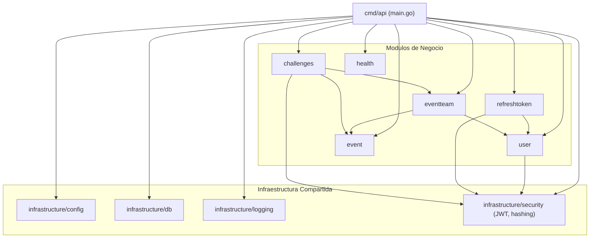

# Arquitectura — golabs-api

## Estilo: Arquitectura Hexagonal

Cada módulo de `internal/` implementa la arquitectura hexagonal (también llamada *Ports & Adapters*). El objetivo es que **el dominio no dependa de ningún framework, driver de BD ni protocolo HTTP**. Las dependencias siempre apuntan hacia adentro.

```
┌─────────────────────────────────────────────┐
│                  interfaces/                 │  ← Adaptadores de entrada (HTTP handlers, DTOs)
│  ┌───────────────────────────────────────┐  │
│  │              application/              │  │  ← Casos de uso (orquesta el dominio)
│  │  ┌─────────────────────────────────┐  │  │
│  │  │            domain/              │  │  │  ← Entidades, reglas de negocio, interfaces (ports)
│  │  └─────────────────────────────────┘  │  │
│  └───────────────────────────────────────┘  │
│                infrastructure/              │  ← Adaptadores de salida (MySQL repositories)
└─────────────────────────────────────────────┘
```

---

## Capas por módulo

| Capa | Paquete | Responsabilidad |
|---|---|---|
| **Domain** | `<modulo>/domain` | Entidades, interfaces de repositorio, reglas de negocio puras |
| **Application** | `<modulo>/application` | Casos de uso: orquestan dominio + repositorios |
| **Interfaces** | `<modulo>/interfaces` | Handlers HTTP, DTOs, registro de rutas |
| **Infrastructure** | `<modulo>/infraestructure` | Implementaciones MySQL de los repositorios |

La capa `domain` **nunca importa** capas externas. Las demás capas importan solo hacia adentro.

---

## Módulos y sus dependencias



---

## Estructura de directorios

```
golabs-api/
├── cmd/
│   └── api/
│       └── main.go              # Bootstrap: config, DB, router, server
│
├── configs/
│   ├── config.yaml              # Configuración base
│   └── config.local.yaml        # Override local (no commitear)
│
├── deployments/
│   └── database/                # MariaDB + Flyway (ver DATABASE.md)
│
├── docs/                        # Esta documentación
│
├── internal/
│   ├── apperrors/               # Errores centinela + helpers HTTP
│   │
│   ├── infrastructure/          # Infraestructura compartida
│   │   ├── config/              # Carga de YAML + env vars
│   │   ├── db/                  # Pool de conexiones MySQL con retry
│   │   ├── logging/             # Configuración de slog (JSON)
│   │   └── security/            # JWTService, Hash(), GenerateJoinSecret()
│   │
│   ├── interfaces/http/         # Middleware compartido
│   │   ├── middleware/
│   │   │   ├── auth/            # JWTAuth, LoadUser
│   │   │   ├── access/          # RequireRole, RequireNotBanned, RequireSelfOrAdmin
│   │   │   └── ratelimit/       # LoginRateLimit, UserRateLimit
│   │   ├── pagination/          # Parse() + New() helpers
│   │   └── validate/            # DecodeAndValidate(), DecodeOnly()
│   │
│   ├── user/                    # Módulo de usuarios
│   │   ├── domain/
│   │   ├── application/         # 11 use cases
│   │   ├── interfaces/          # AuthHandler + UserHandler + routes
│   │   └── infrastructure/
│   │
│   ├── refreshtoken/            # Módulo de refresh tokens
│   │   ├── domain/
│   │   ├── application/         # Issue, Refresh, Revoke
│   │   └── infrastructure/
│   │
│   ├── event/                   # Módulo de eventos CTF
│   │   ├── domain/
│   │   ├── application/         # Create, Get, List, Open, Start, Finish
│   │   ├── interfaces/
│   │   └── infraestructure/
│   │
│   ├── eventteam/               # Módulo de equipos
│   │   ├── domain/
│   │   ├── application/         # Create, Join, Leave, RotateSecret, List, Leaderboard
│   │   ├── interfaces/
│   │   └── infraestructure/
│   │
│   ├── challenges/              # Módulo de retos CTF
│   │   ├── domain/
│   │   ├── application/         # Create, Update, Publish, SetFlag, Submit, List, Get
│   │   ├── interfaces/
│   │   └── infraestructure/
│   │
│   └── health/                  # Health checks
│
├── tools/
│   └── api-tester/              # Herramienta de prueba manual (Flask)
│
├── Dockerfile                   # Build multi-stage
├── docker-compose.yml           # Stack completo (API + BD)
└── Makefile
```

---

## Flujo de una petición HTTP

```
Request HTTP
    │
    ▼
chi Router
    │
    ├── Global middleware (RequestID, RealIP, Recoverer, MaxBodySize, CORS)
    │
    ├── Route middleware (JWTAuth → LoadUser → RequireNotBanned → RateLimit → RequireRole)
    │
    ▼
Handler (interfaces/)
    │  Lee URL params y body, valida DTOs
    ▼
Use Case (application/)
    │  Orquesta reglas de negocio y repositorios
    ▼
Domain (domain/)
    │  Valida reglas de negocio puras
    ▼
Repository interface (domain/)
    │
    ▼
MySQL Repository (infraestructure/)
    │  Ejecuta SQL
    ▼
MariaDB
```

---

## Inicialización del servidor (`main.go`)

```
1. Cargar configuración (YAML + env vars)
2. Conectar a la BD con retry (waitForDB)
3. Inicializar JWTService con JWT_SECRET
4. Crear chi router con middleware global
5. Registrar rutas de cada módulo
6. Escuchar señales OS (SIGTERM, SIGINT) para shutdown graceful
7. Iniciar HTTP server
```

---

## Decisiones de arquitectura notables

| Decisión | Justificación |
|---|---|
| Sin ORM | Consultas SQL explícitas para control total y sin magia implícita |
| Interfaces en el dominio | Permite testear use cases sin BD real (inyección de mocks) |
| `apperrors` centralizado | Evita duplicar la lógica de mapeo error→HTTP status en cada handler |
| `JWTAuth` sin `LoadUser` en admin routes | Evita consulta a BD cuando el rol ya viene en el token |
| Retry en conexión a BD | Permite que el contenedor de la API arranque antes que la BD en Docker |
| Paginación manual en events | La lista de eventos activos es pequeña y no justifica paginación en BD |
