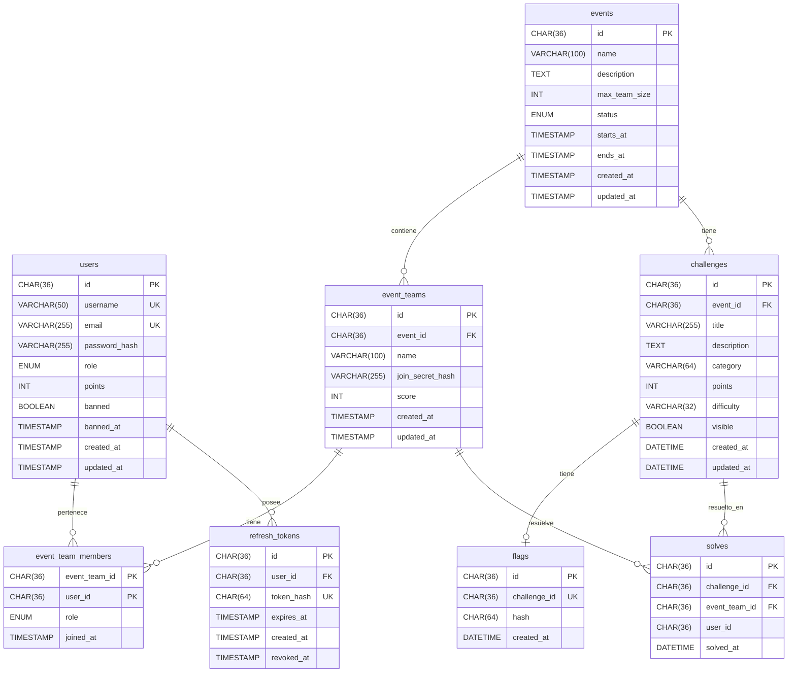

# Esquema de Base de Datos — golabs-api

Motor: **MariaDB 11**  
Gestor de migraciones: **Flyway 10**  
Ubicación de migraciones: `deployments/database/init/`

---

## Diagrama entidad-relación



---

## Tablas

### `users`

Almacena las cuentas de usuario de la plataforma.

| Columna | Tipo | Nulo | Default | Descripción |
|---|---|---|---|---|
| `id` | `CHAR(36)` | NO | — | UUID en formato string |
| `username` | `VARCHAR(50)` | NO | — | Nombre único de usuario |
| `email` | `VARCHAR(255)` | NO | — | Email único |
| `password_hash` | `VARCHAR(255)` | NO | — | Hash bcrypt de la contraseña (costo 12) |
| `role` | `ENUM('admin','user')` | NO | `'user'` | Rol de acceso |
| `points` | `INT` | NO | `0` | Puntos acumulados en eventos |
| `banned` | `BOOLEAN` | NO | `FALSE` | Si el usuario está suspendido |
| `banned_at` | `TIMESTAMP` | SÍ | `NULL` | Fecha y hora del baneo |
| `created_at` | `TIMESTAMP` | NO | — | Fecha de creación |
| `updated_at` | `TIMESTAMP` | NO | — | Última modificación |

**Constraints:** `PRIMARY KEY (id)`, `UNIQUE (email)`, `UNIQUE (username)`

---

### `events`

Representa un evento CTF con su ciclo de vida completo.

| Columna | Tipo | Nulo | Default | Descripción |
|---|---|---|---|---|
| `id` | `CHAR(36)` | NO | — | UUID |
| `name` | `VARCHAR(100)` | NO | — | Nombre del evento |
| `description` | `TEXT` | SÍ | — | Descripción larga |
| `max_team_size` | `INT` | NO | — | Máximo de miembros por equipo |
| `status` | `ENUM('draft','open','running','finished')` | NO | — | Estado actual |
| `starts_at` | `TIMESTAMP` | NO | — | Inicio programado |
| `ends_at` | `TIMESTAMP` | NO | — | Fin programado |
| `created_at` | `TIMESTAMP` | NO | — | Fecha de creación |
| `updated_at` | `TIMESTAMP` | NO | — | Última modificación |

**Constraints:** `PRIMARY KEY (id)`

---

### `event_teams`

Equipos inscriptos en un evento.

| Columna | Tipo | Nulo | Default | Descripción |
|---|---|---|---|---|
| `id` | `CHAR(36)` | NO | — | UUID |
| `event_id` | `CHAR(36)` | NO | — | FK → `events.id` |
| `name` | `VARCHAR(100)` | NO | — | Nombre del equipo (único por evento) |
| `join_secret_hash` | `VARCHAR(255)` | NO | — | SHA-256 del join secret para invitar miembros |
| `score` | `INT` | NO | `0` | Puntos acumulados en el evento |
| `created_at` | `TIMESTAMP` | NO | — | Fecha de creación |
| `updated_at` | `TIMESTAMP` | NO | — | Última modificación |

**Constraints:** `PRIMARY KEY (id)`, `UNIQUE (event_id, name)`, `FOREIGN KEY (event_id) → events(id)`

> El `join_secret_hash` almacena SHA-256 del secreto en texto plano. El secreto crudo nunca se persiste.

---

### `event_team_members`

Tabla de unión entre equipos y usuarios. Define quién pertenece a qué equipo.

| Columna | Tipo | Nulo | Default | Descripción |
|---|---|---|---|---|
| `event_team_id` | `CHAR(36)` | NO | — | FK → `event_teams.id` |
| `user_id` | `CHAR(36)` | NO | — | FK → `users.id` |
| `role` | `ENUM('owner','member')` | NO | — | Rol en el equipo |
| `joined_at` | `TIMESTAMP` | NO | — | Fecha de ingreso |

**Constraints:** `PRIMARY KEY (event_team_id, user_id)`

---

### `challenges`

Retos CTF asociados a un evento.

| Columna | Tipo | Nulo | Default | Descripción |
|---|---|---|---|---|
| `id` | `CHAR(36)` | NO | — | UUID |
| `event_id` | `CHAR(36)` | NO | — | FK → `events.id` |
| `title` | `VARCHAR(255)` | NO | — | Título del reto |
| `description` | `TEXT` | NO | — | Enunciado del reto |
| `category` | `VARCHAR(64)` | NO | — | Categoría (`web`, `pwn`, `rev`, `crypto`, `forensics`, `misc`) |
| `points` | `INT` | NO | `0` | Puntos al resolver |
| `difficulty` | `VARCHAR(32)` | NO | `'medium'` | Dificultad (`easy`, `medium`, `hard`) |
| `visible` | `BOOLEAN` | NO | `FALSE` | Si es visible para participantes |
| `created_at` | `DATETIME` | NO | — | Fecha de creación |
| `updated_at` | `DATETIME` | NO | — | Última modificación |

**Constraints:** `PRIMARY KEY (id)`, `FOREIGN KEY (event_id) → events(id)`

---

### `flags`

Almacena el hash de la flag de cada reto. Relación 1:1 con `challenges`.

| Columna | Tipo | Nulo | Default | Descripción |
|---|---|---|---|---|
| `id` | `CHAR(36)` | NO | — | UUID |
| `challenge_id` | `CHAR(36)` | NO | — | FK única → `challenges.id` |
| `hash` | `CHAR(64)` | NO | — | SHA-256 hex de la flag en texto plano |
| `created_at` | `DATETIME` | NO | — | Fecha de creación/rotación |

**Constraints:** `PRIMARY KEY (id)`, `UNIQUE (challenge_id)`, `FOREIGN KEY (challenge_id) → challenges(id)`

> **Seguridad**: el texto plano de la flag nunca se almacena. Solo el hash SHA-256.

---

### `solves`

Registro de resoluciones de retos por equipo.

| Columna | Tipo | Nulo | Default | Descripción |
|---|---|---|---|---|
| `id` | `CHAR(36)` | NO | — | UUID |
| `challenge_id` | `CHAR(36)` | NO | — | FK → `challenges.id` |
| `event_team_id` | `CHAR(36)` | NO | — | FK → `event_teams.id` |
| `user_id` | `CHAR(36)` | NO | — | Quién envió la flag (referencia sin constraint) |
| `solved_at` | `DATETIME` | NO | — | Momento exacto de la resolución |

**Constraints:** `PRIMARY KEY (id)`, `UNIQUE (challenge_id, event_team_id)`, FK en `challenge_id` y `event_team_id`

> El constraint `UNIQUE (challenge_id, event_team_id)` garantiza que un equipo no registre más de una resolución por reto.

---

### `refresh_tokens`

Tokens de refresco con soporte de revocación y rotación.

| Columna | Tipo | Nulo | Default | Descripción |
|---|---|---|---|---|
| `id` | `CHAR(36)` | NO | — | UUID |
| `user_id` | `CHAR(36)` | NO | — | FK → `users.id` (CASCADE DELETE) |
| `token_hash` | `CHAR(64)` | NO | — | SHA-256 del token en texto plano |
| `expires_at` | `TIMESTAMP` | NO | — | Vencimiento del token |
| `created_at` | `TIMESTAMP` | NO | NOW() | Fecha de emisión |
| `revoked_at` | `TIMESTAMP` | SÍ | `NULL` | Fecha de revocación (NULL = activo) |

**Constraints:** `PRIMARY KEY (id)`, `UNIQUE (token_hash)`, `FOREIGN KEY (user_id) → users(id) ON DELETE CASCADE`

> Si se elimina un usuario, todos sus refresh tokens se eliminan automáticamente (CASCADE DELETE).

---

## Índices

| Índice | Tabla | Columnas | Propósito |
|---|---|---|---|
| `idx_challenges_event_visible` | `challenges` | `(event_id, visible)` | Lista de challenges por evento + filtro de visibilidad |
| `idx_challenges_event_category` | `challenges` | `(event_id, category)` | Filtro por categoría |
| `idx_solves_challenge_solved_at` | `solves` | `(challenge_id, solved_at)` | First blood y conteo de solves |
| `idx_event_teams_event_score` | `event_teams` | `(event_id, score DESC)` | Leaderboard ordenado |
| `idx_etm_team_id` | `event_team_members` | `(event_team_id)` | Lista de miembros de un equipo |
| `idx_etm_event_user` | `event_team_members` | `(user_id)` | Verificación de membresía de usuario |
| `idx_rt_token_hash` | `refresh_tokens` | `(token_hash)` | Lookup de token en cada refresh/logout |
| `idx_rt_user_id` | `refresh_tokens` | `(user_id)` | Revocación masiva de tokens de un usuario |
| `uq_users_username` | `users` | `(username)` | Unicidad y búsqueda por username |

---

## Agregar una migración

Las migraciones siguen la convención de Flyway: `V{n}__{descripcion}.sql`.

```bash
# Crear nueva migración
touch deployments/database/init/V9__mi_cambio.sql

# Aplicar
cd deployments/database && make migrate
```

> Flyway never re-runs an applied migration. Para modificar un esquema existente, siempre crear una nueva versión (`V9`, `V10`, etc.).
